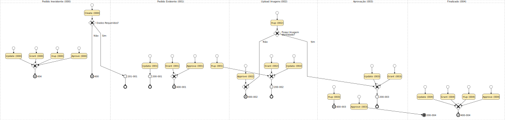

# Apontte

API para registro de novos contratos de crédito.

## Endpoints:

- Create: cria um registro novo;
- Update: atualiza o registro;
- Hup: passa o registro para o próximo estágio;
- Grant: monta a url para upload das imagens no s3;
- Approve: aprova/desaprova o pedido.

Para mais informações sobre os endpoints, consultar [swagger](./swagger/swagger.yml).

# Testes Integrados

## Casos de Uso:



_[criado com BPMN Sketch Miner](https://www.bpmn-sketch-miner.ai)_

## Execução Local:

### Requisitos:

- docker
- docker-compose
- nodejs
- npm

```sh
npm start
```

### Execução dos testes:

```sh
npm run test:acceptance
```

# Deploy:

```sh
npm run deploy
```

# TODO

- Melhorar testes unitários
- Melhorar testes Integrados
